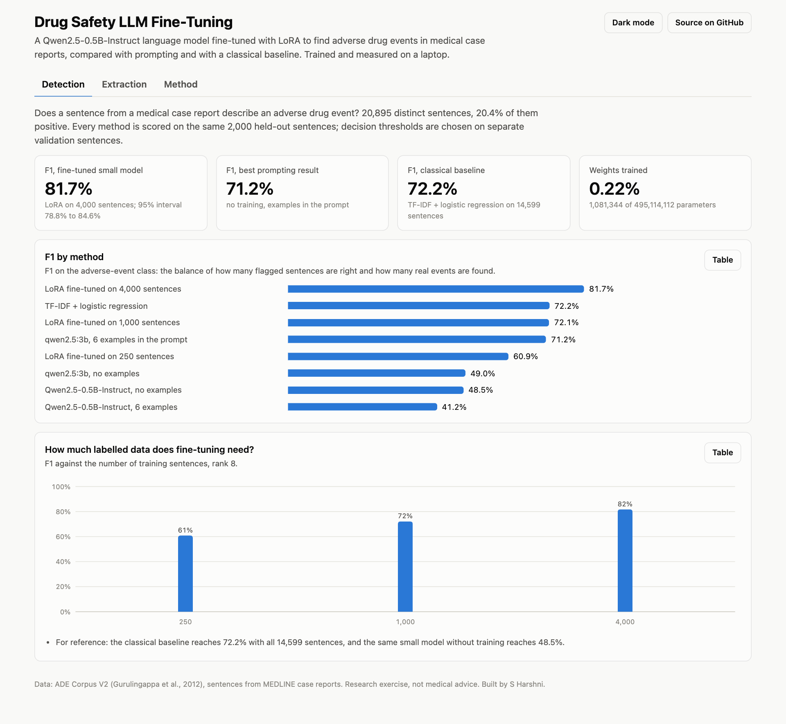
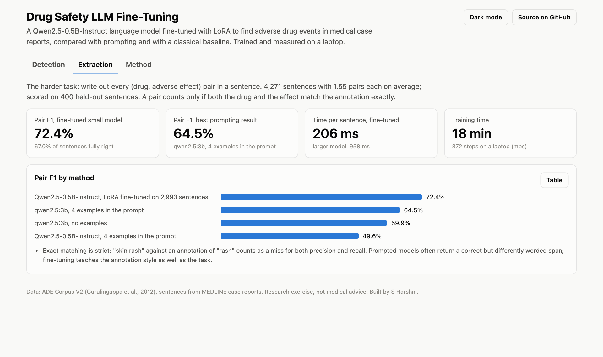

# Drug Safety LLM Fine-Tuning


-ee4c2c)


When is it worth fine-tuning a small language model instead of prompting a larger one? This project answers that on a real pharmacovigilance task: finding **adverse drug events** in sentences from medical case reports. A 0.5-billion-parameter open-source model is fine-tuned with **LoRA** on a laptop and compared with prompting, with a model six times larger, and with a classical baseline.

**Live demo:** https://s-harshni.github.io/Drug-Safety-LLM-FineTuning/



## The two tasks

| Task | Input | Output | Data |
| --- | --- | --- | --- |
| **Detection** | A sentence from a case report | Does it describe an adverse drug event? | 20,895 distinct sentences, 20.4% positive |
| **Extraction** | A sentence that does | Every (drug, adverse effect) pair in it | 4,271 sentences, 1.55 pairs each on average |

Data: [ADE Corpus V2](https://huggingface.co/datasets/ade-benchmark-corpus/ade_corpus_v2) (Gurulingappa et al., 2012), sentences from MEDLINE case reports. Repeated sentences are merged before splitting, and the split (70% train, 10% validation, 20% test) is decided by a hash of the sentence, so no sentence is on both sides.

## Results

### Detection

Every method is scored on the same 2,000 held-out sentences. Thresholds are chosen on validation sentences, never on the test set.

| Method | F1 | 95% interval | Precision | Recall | Time per sentence |
| --- | ---: | ---: | ---: | ---: | ---: |
| **Qwen2.5-0.5B-Instruct + LoRA, 4,000 training sentences** | 81.7% | 78.8%–84.6% | 81.0% | 82.4% | 37 ms |
| TF-IDF + logistic regression (classical baseline) | 72.2% | 68.7%–75.7% | 70.6% | 73.8% | 0.05 ms |
| Qwen2.5-0.5B-Instruct + LoRA, 1,000 training sentences | 72.1% | 68.7%–75.4% | 65.5% | 80.2% | 38 ms |
| qwen2.5:3b (6× larger), 6 examples in the prompt | 71.2% | 64.0%–77.8% | 67.5% | 75.4% | 263 ms |
| Qwen2.5-0.5B-Instruct + LoRA, 250 training sentences | 60.9% | 57.2%–64.6% | 50.7% | 76.0% | 52 ms |
| qwen2.5:3b (6× larger), no examples | 49.0% | 38.5%–58.4% | 84.4% | 34.5% | 248 ms |
| Qwen2.5-0.5B-Instruct, no examples in the prompt | 48.5% | 45.0%–51.9% | 35.9% | 74.5% | 37 ms |
| Qwen2.5-0.5B-Instruct, 6 examples in the prompt | 41.2% | 38.1%–44.2% | 27.2% | 84.7% | 159 ms |

- **Fine-tuning is the best method here.** LoRA on 4,000 sentences reaches **81.7% F1** (95% interval 78.8%–84.6%), against 71.2% for the best prompting result and 72.2% for the classical baseline trained on all 14,599 sentences. The intervals do not overlap.
- **But it needs enough data.** F1 by number of training sentences: 60.9% with 250, 72.1% with 1,000, 81.7% with 4,000. With 250 sentences it is below the classical baseline, with 1,000 it matches it, and the lead comes at 4,000.
- **It trains 0.22% of the weights**: 1,081,344 of 495,114,112 parameters, in 25 minutes on a laptop.
- **Prompting the small model is not enough.** Without training it scores 48.5%, and adding examples to the prompt made it worse (41.2%).
- **A model six times larger, with examples in the prompt, gets close to the baseline** (71.2%) but takes 263 ms per sentence against 37 ms for the fine-tuned small model.

### Extraction

Scored on 400 held-out sentences. A pair counts only if both the drug and the effect match the annotation exactly.

| Method | Pair F1 | Precision | Recall | Sentences fully right | Time per sentence |
| --- | ---: | ---: | ---: | ---: | ---: |
| **Qwen2.5-0.5B-Instruct + LoRA, 2,993 training sentences** | 72.4% | 72.5% | 72.2% | 67.0% | 206 ms |
| qwen2.5:3b (6× larger), 4 examples in the prompt | 64.5% | 68.9% | 60.7% | 52.8% | 958 ms |
| qwen2.5:3b (6× larger), no examples | 59.9% | 64.8% | 55.7% | 50.7% | 1109 ms |
| Qwen2.5-0.5B-Instruct, 4 examples in the prompt | 49.6% | 46.4% | 53.4% | 37.5% | 510 ms |

The fine-tuned 0.5B model reaches **72.4%** pair F1 and gets 67.0% of sentences fully right, against 64.5% and 52.8% for the best prompted model. Exact matching is strict ("skin rash" against an annotation of "rash" is a miss), so part of the gain is the fine-tuned model learning the annotation style as well as the task.



## How it works

- **Base model:** [`Qwen/Qwen2.5-0.5B-Instruct`](https://huggingface.co/Qwen/Qwen2.5-0.5B-Instruct), frozen.
- **LoRA:** low-rank adapters on the attention projections (q_proj, k_proj, v_proj, o_proj) through the PEFT library ([`finetune.py`](src/drugsafety/finetune.py)).
- **Training:** 2 epochs, AdamW, warm-up and linear decay, gradient clipping. The loss is computed on the answer tokens only. Each optimiser step accumulates gradients over micro-batches so back-propagation fits in laptop memory.
- **Reading the answer:** detection compares the logits of "yes" and "no" in one forward pass, which gives a score that can be thresholded; extraction generates `drug | effect` lines with greedy decoding.
- **Same instructions for every model** ([`prompts.py`](src/drugsafety/prompts.py)): the fine-tuned model, the untrained one and the larger prompted one, so the comparison is about the method.

## Run it

```bash
python -m venv .venv && source .venv/bin/activate
pip install -r requirements.txt
python run.py               # downloads the corpus; baseline, prompting the small model, all LoRA runs (resumable)
ollama pull qwen2.5:3b && python eval_prompting.py    # the larger prompted model
python demo_examples.py     # runs the adapters on sentences written for the demo page
python build_demo.py        # docs/data.json for the demo page
pytest -q                   # 10 tests
```

Tested on an Apple-silicon laptop (mps); it also runs on CUDA or, slowly, on CPU.

## Tests

10 tests, run in CI: the hash split and de-duplication, every metric on a hand-worked case, threshold selection, the bootstrap interval, prompt construction and parsing, that a fresh LoRA adapter changes nothing and trains only adapter weights, and that training labels cover only the answer tokens.

## Limitations

- The public corpus has no document ids, so sentences from the same case report can fall on both sides of the split. That favours every trained method, the baseline included.
- One random seed and one base model; the 95% intervals show how much the test sample alone moves a score.
- The larger model was prompted on 500 detection sentences (the fine-tuned model on 2,000) to keep the run time reasonable.
- Extraction is scored by exact match, which under-rates answers that are right but worded differently.
- This is a research exercise on published literature. It is not a medical device and makes no clinical claims.

## Data

Gurulingappa, H., et al. (2012). *Development of a benchmark corpus to support the automatic extraction of drug-related adverse effects from medical case reports.* Journal of Biomedical Informatics. The corpus is downloaded at run time and not redistributed here.

## Author

[S Harshni](https://github.com/S-Harshni)
